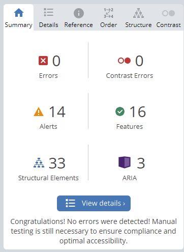

# Frontend Mentor - Single-page developer portfolio

This is a solution to the [Single-page developer portfolio challenge on Frontend Mentor](https://www.frontendmentor.io/challenges/singlepage-developer-portfolio-bBVj2ZPi-x). Frontend Mentor challenges help you improve your coding skills by building realistic projects.  


## Technologies

The technologies used in this design are:

* HTML & Tailwind & Ts
* Angular

## Setup

To run this app in development mode open the terminal and write the following:

```sh  
git clone https://github.com/Zakaria9375/fm-developper-portfolio.git 

cd fm-developper-portfolio  

npm install 
 
// you need to install angular cli to run this app in development mode
npm install -g @angular/cli

ng serve
```

## Links

* Single-page developer portfolio - [Challenge](https://www.frontendmentor.io/challenges/singlepage-developer-portfolio-bBVj2ZPi-x)  
* Single-page developer portfolio website - [Live](https://za-developper-portfolio.netlify.app/)  
* Frontend Mentor Profile - [@zakaria](https://www.frontendmentor.io/profile/Zakaria9375)

## Testing for Accessibility

Scopes of Accessibility testing for this app:  

* Zooming: No loss of content or functionality.
* Zooming (text-only): No loss of content till 150%.
* Keyboard-only: Interactive elements are accessible(focusable) and clickable.



all alerts are for redundant links that do not go anywhere but the home page
